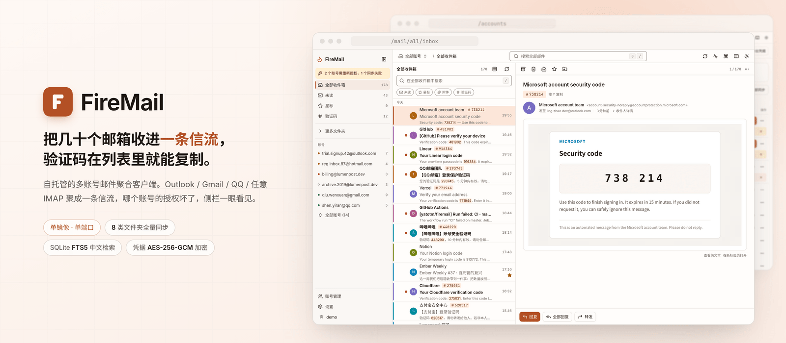
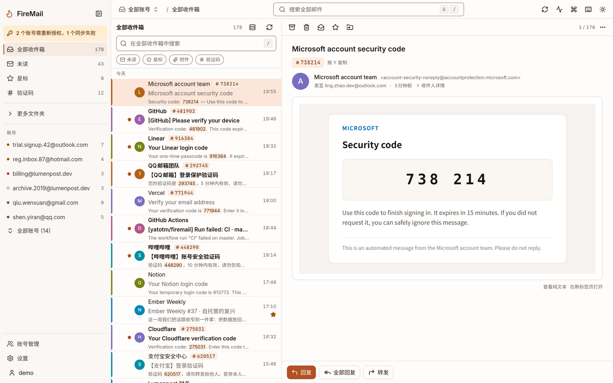
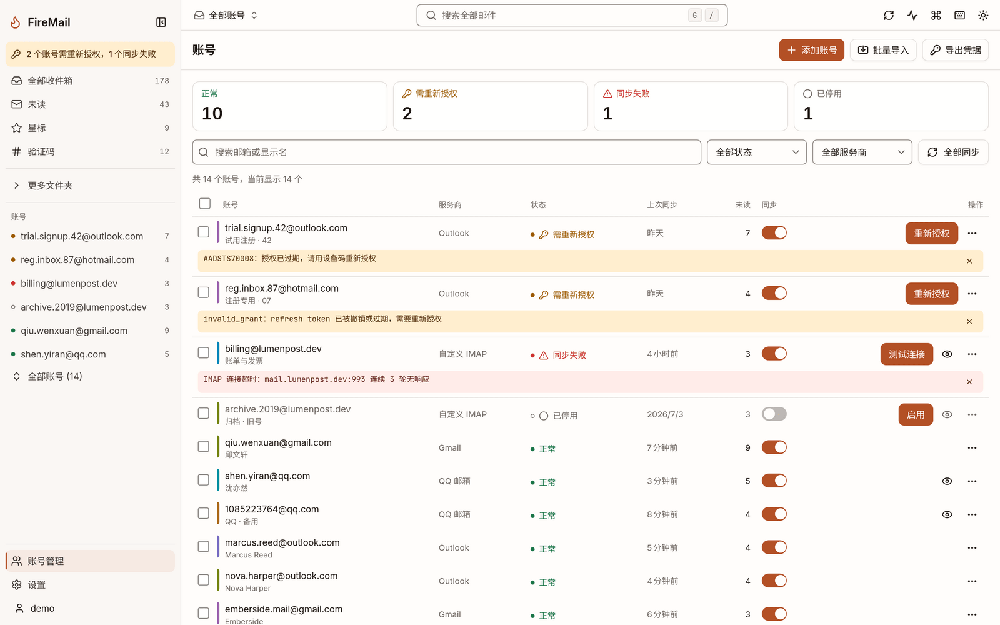
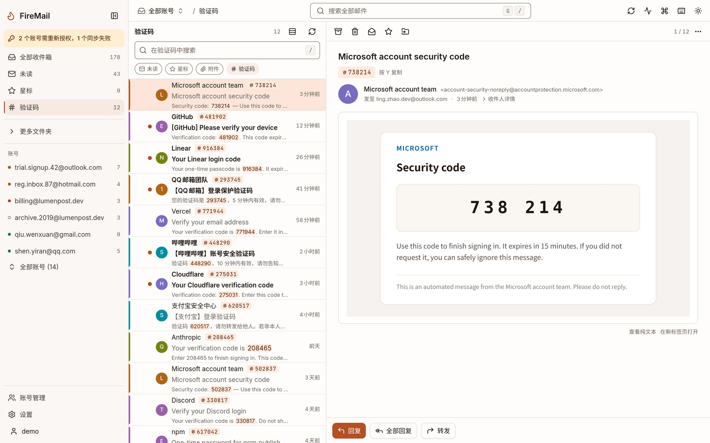
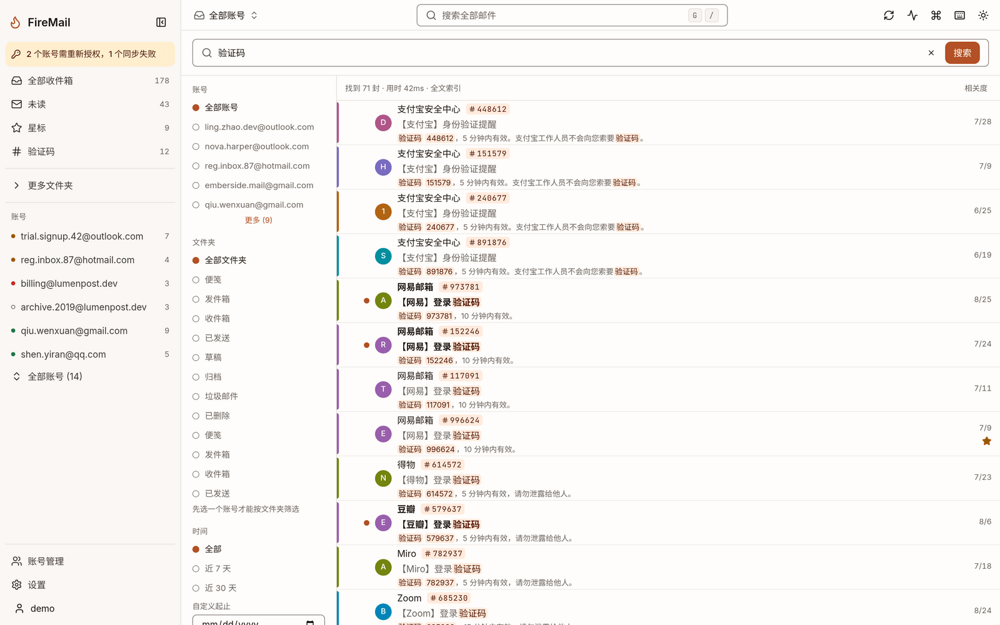
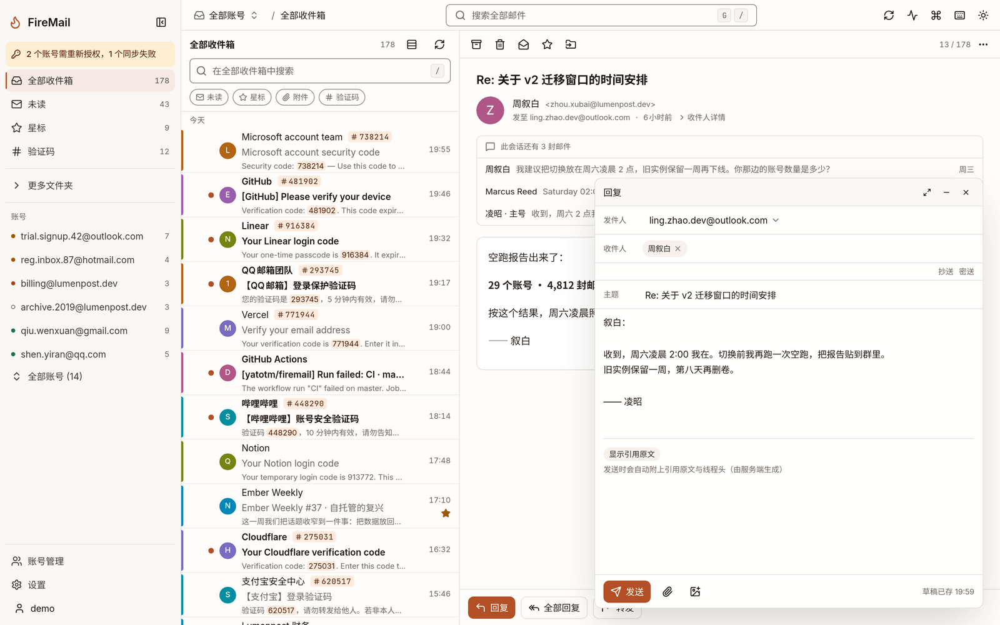
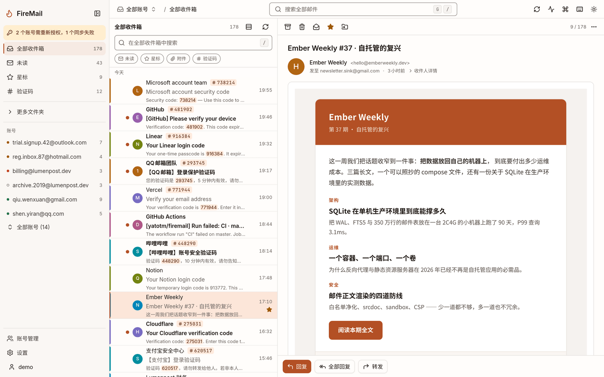
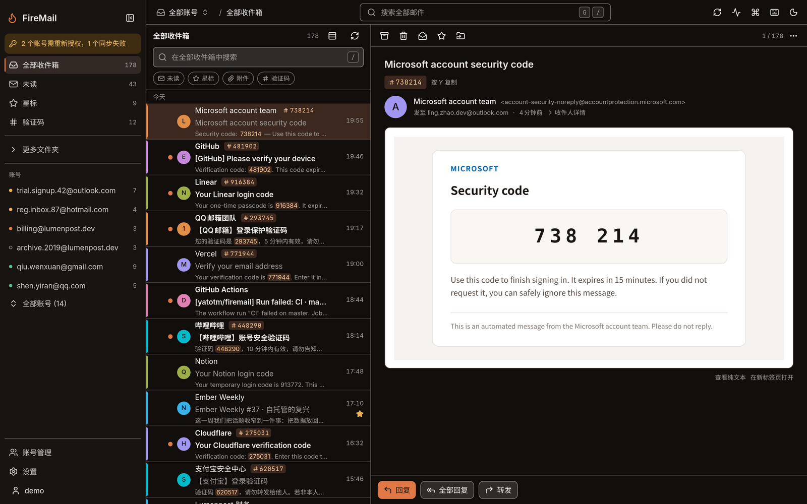
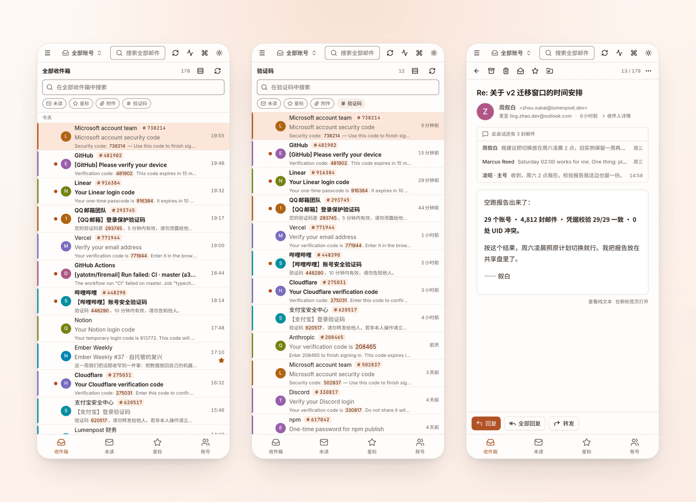

<div align="center">

<picture>
  <source media="(prefers-color-scheme: dark)" srcset="docs/images/hero-dark.png" />
  <source media="(prefers-color-scheme: light)" srcset="docs/images/hero-light.png" />
  
</picture>

**Self-hosted mail aggregator for people who run a lot of mailboxes.**
Outlook, Gmail, QQ Mail and plain IMAP in one stream, with account health always in view.

[](LICENSE)
[](package.json)
[](https://hub.docker.com/r/yatotm1994/firemail)
[](https://github.com/yatotm/firemail-v2/actions/workflows/docker-image.yml)

[Quick start](#quick-start) · [Screenshots](#screenshots) · [Docs](docs/README.md) · [Upgrading from v1](docs/migration-v1-to-v2.md)

English | [简体中文](README.zh-CN.md)

</div>

---

## What it is

You have dozens of mailboxes and most of what lands in them is verification codes and signup mail. FireMail merges them into one list, pulls the codes out so you can copy them without opening anything, and keeps each account's auth status in the sidebar.

It is not a replacement for a general-purpose mail client. There are users and roles, but the design target is one person self-hosting.

## Screenshots

Demo instance. Every address, name and message in the shots is made up.

| Unified inbox | Account health |
| --- | --- |
| [](docs/images/inbox-light.png) | [](docs/images/accounts-light.png) |

<details>
<summary>More screenshots — codes, search, compose, reading, dark mode, mobile</summary>

| Codes view, last 7 days | Full-text search |
| --- | --- |
| [](docs/images/codes-light.png) | [](docs/images/search-light.png) |

| Compose | Message body |
| --- | --- |
| [](docs/images/compose-light.png) | [](docs/images/reading-light.png) |

| Dark mode | Mobile, single column under 768px |
| --- | --- |
| [](docs/images/inbox-dark.png) | [](docs/images/mobile-light.png) |

</details>

## Quick start

```bash
git clone https://github.com/yatotm/firemail-v2.git
cd firemail
cp .env.example .env

# Generate a key, put it in .env as FIREMAIL_ENCRYPTION_KEY
openssl rand -base64 32

docker compose up -d
```

Open `http://<host>:12380`. Change the host port in `docker-compose.yml` if 12380 is taken — v1 used it too.

No seeded account, no default password. The first user to register becomes the admin; after that, registration stays closed until an admin opens it in settings.

Reverse proxy, backups, health checks and upgrades: [docs/deployment.md](docs/deployment.md).

## The encryption key

`FIREMAIL_ENCRYPTION_KEY` encrypts every stored credential — IMAP and SMTP passwords, OAuth refresh and access tokens.

> **Lose it and every account has to be re-authorized one by one. There is no recovery.**

Leave it empty and the server writes one to `<data dir>/.encryption-key` on first boot. That works, but back up the whole data directory — `firemail.db` without the key is not a backup. Start with the wrong key and the server refuses to boot rather than silently failing every account.

<details>
<summary><b>Features</b> — accounts, sync, reading, writing, search, security, deployment</summary>

| Area | What it does |
| --- | --- |
| Accounts | Outlook/Hotmail via OAuth2 (refresh token or device code), Gmail, QQ Mail, any IMAP server. Bulk import takes one account per line: `email----password----clientId----refreshToken` |
| Health | Every account is `active`, `auth_error`, `error` or `disabled`. `auth_error` you can fix yourself by re-authorizing; `error` is systemic. Credentials can be viewed and exported on demand through a separate `no-store` endpoint |
| Sync | 8 special-use folders: inbox, sent, drafts, trash, junk, archive, notes, outbox (v1 only did inbox). Incremental on `(UIDVALIDITY, UID high-water)` with gap detection; when UIDVALIDITY changes, rows are re-claimed by `Message-ID` instead of wiped. Scheduling jitters ±20%, one sync per account at a time, bounded connection pool |
| Reading | Threads, stars, bulk mark/move/delete. Flag changes go to IMAP first, then local |
| Writing | New, reply, reply-all, forward, with attachments, inline images and a per-account signature. Send and sync both answer `202` and report progress by poll or push, so no request ever hangs on an SMTP session. `Idempotency-Key` is honoured — a replay does not send twice |
| Codes | A dedicated view over the last 7 days. The server tags the messages, the list highlights the digits, one click copies |
| Search | SQLite FTS5 with the trigram tokenizer, so CJK substrings match. Queries under 3 characters fall back to `LIKE`, and the response `mode` field says which path ran |
| Security | Credentials encrypted with AES-256-GCM, key never stored in the database, never returned by the API. Message bodies get sanitized server-side, rendered into an `<iframe srcdoc>` whose sandbox omits `allow-scripts`, under CSP. Remote images are blocked until you allow them, then fetched through an HMAC-signed proxy. Session tokens are stored as sha256 |
| Live updates | SSE, with same-type events coalesced and replay via `Last-Event-ID` |
| Deployment | One image, one port — Fastify serves both the API and the SPA, no nginx or Caddy. Runs as a non-root user, about 250 MB, `linux/amd64` and `linux/arm64`. Migrations run at startup |

</details>

<details>
<summary><b>Configuration</b> — environment variables</summary>

Everything is an environment variable. They are validated at startup; a bad value aborts the boot.

| Variable | Default | Notes |
| --- | --- | --- |
| `PORT` | `3000` | In-container port, shared by API and SPA |
| `TZ` | system | IANA zone, e.g. `Asia/Shanghai` |
| `FIREMAIL_ENCRYPTION_KEY` | generated | 32 bytes as hex or base64. See above |
| `FIREMAIL_DATA_DIR` | `/app/data` | Key file and attachments |
| `FIREMAIL_DB_PATH` | `<data dir>/firemail.db` | SQLite file |
| `FIREMAIL_SYNC_CONCURRENCY` | `2` | Parallelism for user-triggered syncs, 1–32. Background sync is serial by design |
| `FIREMAIL_SYNC_SCHEDULER` | `true` | Periodic sync on/off |
| `FIREMAIL_SYNC_MAX_ATTEMPTS` | `3` | Tries per account per round, 1–5 |
| `FIREMAIL_CORS_ORIGINS` | empty | Comma-separated allowlist. `*` is rejected |
| `FIREMAIL_TRUST_PROXY` | `false` | Turn on behind a reverse proxy |
| `FIREMAIL_MAX_UPLOAD_MB` | `25` | Per attachment, 1–200 |
| `LOG_LEVEL` | `info` | pino level |

The rest — background sync pacing and time budget, auto-suspend thresholds, session lifetime, SSE connection cap, shutdown grace — are in [docs/configuration.md](docs/configuration.md) with ranges and failure modes.

</details>

<details>
<summary><b>Upgrading from v1</b> — one-shot migration CLI</summary>

The schemas have nothing in common, so there is no in-place upgrade. A CLI moves the data across.

```bash
# 1. Stop v1 and snapshot its database. The old app rotates refresh tokens every
#    60s, and verifying against a live file produces false mismatches.
docker stop firemail
cp /path/to/firemail-v1/backend/data/huohuo_email.db /tmp/huohuo-snapshot.db

# 2. Dry run first: report only, nothing written
node --experimental-strip-types tools/migrate-legacy/src/cli.ts \
  --from /tmp/huohuo-snapshot.db --to /tmp/trial.db --dry-run

# 3. Real run, followed by a per-account credential check
node --experimental-strip-types tools/migrate-legacy/src/cli.ts \
  --from /tmp/huohuo-snapshot.db --to ./data/firemail.db --data-dir ./data
```

The check is byte-exact: the sha256 of each plaintext `refresh_token` in the old database must equal the sha256 of the value decrypted from the new one. Any mismatch exits 1. The old database is opened read-only throughout, so you can always roll back.

Full walkthrough: [docs/migration-v1-to-v2.md](docs/migration-v1-to-v2.md).

</details>

<details>
<summary><b>Architecture</b> — one process, SQLite, in-process sync engine</summary>

```
                        ┌──────────────────────────────────────┐
   Browser ──HTTP──▶    │  Fastify 5                           │
             SSE ──▶    │    /api/*   REST + SSE               │
                        │    /*       SPA assets + fallback    │
                        └──────┬───────────────────┬───────────┘
                               │                   │
                   ┌───────────▼──────┐   ┌────────▼────────────┐
                   │ SQLite           │   │ Sync engine         │
                   │ better-sqlite3   │◀──│ 3 tiers, bounded    │
                   │ WAL + FTS5       │   │ connection pool     │
                   └──────────────────┘   └────────┬────────────┘
                                                   │
                                          IMAP / SMTP / OAuth
```

pnpm monorepo, Node 22, TypeScript ESM throughout.

| Package | Stack |
| --- | --- |
| `apps/server` | Fastify 5 · Drizzle ORM · better-sqlite3 · ImapFlow · Nodemailer · postal-mime · pino |
| `apps/web` | React 19 · Vite 6 · Tailwind v4 · shadcn/ui · react-router v7 · TanStack Query v5 |
| `packages/shared` | zod contracts — the single source of truth for requests, responses and SSE events |
| `tools/migrate-legacy` | v1 → v2 migration and verification CLI |

Module layout, sync engine and security boundaries: [docs/architecture.md](docs/architecture.md). Endpoints: [docs/api.md](docs/api.md).

</details>

<details>
<summary><b>Development</b> — local setup and commands</summary>

```bash
corepack enable
pnpm install

export FIREMAIL_CORS_ORIGINS=http://localhost:5173   # see below
pnpm dev            # server :3000 + web :5173
```

```bash
pnpm typecheck      # whole repo
pnpm test           # whole repo
pnpm build          # shared → web → server
```

Vite's proxy sets `changeOrigin: true`, so the server sees `Host: localhost:3000` while the browser sends `Origin: localhost:5173`. Without that origin allowlisted, CSRF checks reject every write.

More in [docs/development.md](docs/development.md), including database migrations, directory conventions and the design specs to read before touching the frontend.

</details>

<details>
<summary><b>Documentation</b> — index</summary>

| | |
| --- | --- |
| [Deployment](docs/deployment.md) | Compose and single container, reverse proxy, backups, health checks, upgrades |
| [Configuration](docs/configuration.md) | Every environment variable, with ranges and failure modes |
| [Architecture](docs/architecture.md) | Process model, sync engine, security boundaries, tables |
| [API reference](docs/api.md) | Endpoints, envelope, pagination, error codes, SSE |
| [Migrating from v1](docs/migration-v1-to-v2.md) | The migration tool, what it verifies, cutover and rollback |
| [Development](docs/development.md) | Running locally, tests, migrations, conventions |
| [Design specs](docs/design/README.md) | Palette, layout, interactions, mail rendering, accessibility |

</details>

<details>
<summary><b>License &amp; disclaimer</b></summary>

[Apache License 2.0](LICENSE). v2 is a complete rewrite of the project credited below, which is distributed under the same license. Its Python/Vue code has been removed from this repository; only the one-shot migration tool `tools/migrate-legacy` remains.

1. Use this only to manage mailboxes you own. Do not use it for anything illegal.
2. You are responsible for your own data security, account security, and for any breach of a third party's terms of service.
3. This project has no official affiliation with Microsoft, Google, Tencent or any other mail provider. Follow their terms.
4. Credentials are encrypted and stored in a local database. Securing the server and safeguarding the encryption key are up to you.
5. Third-party API limits or policy changes can break features. No guarantee of compatibility or availability is made.
6. The software is provided "as is", without warranty of any kind, express or implied.

</details>

---

<div align="center">

FireMail grew out of [fengyuanluo/firemail](https://github.com/fengyuanluo/firemail) — thanks to the original author for the groundwork. That project is archived; this repository is an independent rewrite built on top of it.

</div>
