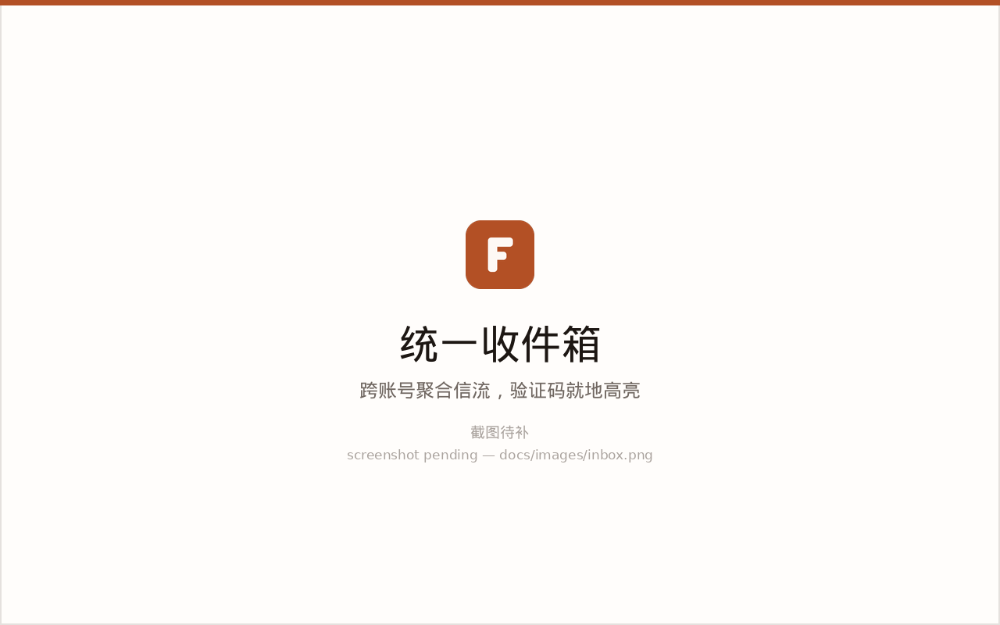
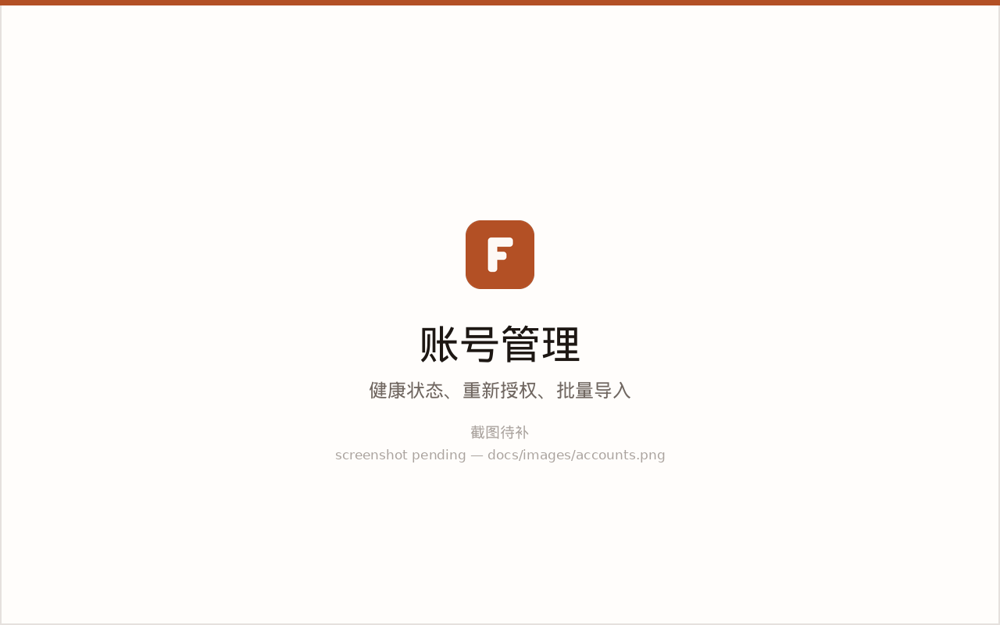
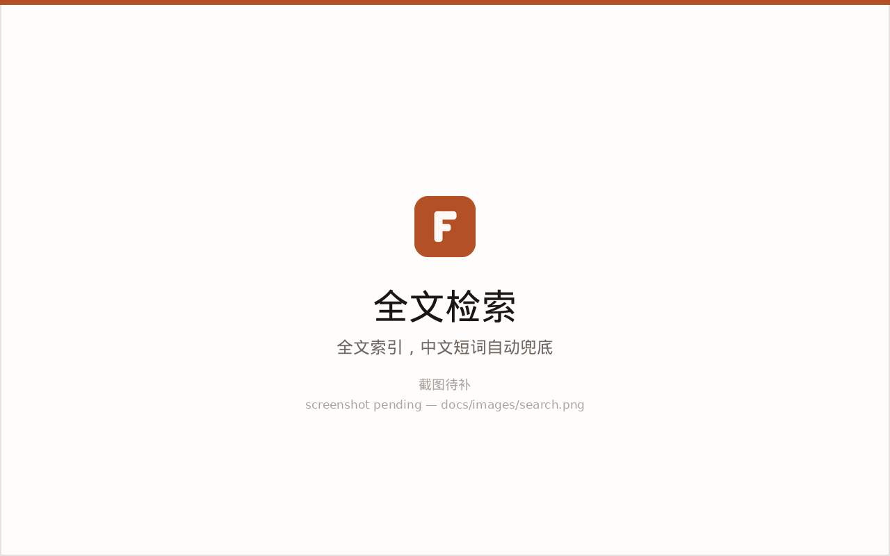

<div align="center">


# FireMail

**自托管的多账号邮件聚合客户端**

把几十个 Outlook / Gmail / QQ / 自建 IMAP 邮箱收进一条信流，一眼看清哪个账号的授权坏了。

[](LICENSE)
[](package.json)
[](Dockerfile)
[](https://github.com/yatotm/firemail/actions/workflows/docker-image.yml)

[快速开始](#快速开始) · [配置](#配置) · [文档](docs/README.md) · [从 v1 迁移](docs/migration-v1-to-v2.md)

</div>

---

## 这是什么

FireMail 是一个**只给自己用**的邮件聚合器。它解决的是这样一类人的问题：

> 手上有几十个邮箱账号，绝大多数邮件是验证码和注册确认信。
> 需要的不是精读一封信，而是**在几十个账号的信流里，三秒内找到那一封**，
> 顺便一眼看出哪几个账号的授权已经挂了。

所以它长成现在这样：默认是跨账号的聚合视图而不是一堆标签页；
验证码在列表行里就高亮出来、一键复制，不用打开邮件；
账号的健康状态是常驻在侧栏的一等信息，而不是一个转瞬即逝的报错提示。

它**不是**一个通用邮件客户端的替代品，也不适合多租户或团队场景——
虽然支持多用户和权限分级，但设计重心是单人自托管。

> **v2 是一次彻底重写。** v1 是 Python/Flask + Vue 2 + 独立 WebSocket 进程 + Caddy，
> 代码仍在 `backend/` 与 `frontend/` 目录里，等切换完成后会删除。
> 老用户请看[从 v1 迁移](docs/migration-v1-to-v2.md)。

## 截图

> 以下是占位图，v2 上线后会换成真实截图。

| 统一收件箱 | 账号管理 | 全文检索 |
| --- | --- | --- |
| [](docs/images/inbox.png) | [](docs/images/accounts.png) | [](docs/images/search.png) |

## 功能

**多账号聚合**

- Outlook / Hotmail（OAuth2，支持 refresh token 与设备码重新授权）、Gmail、QQ 邮箱、任意 IMAP
- 跨账号的统一信流，也可以按单个账号查看
- 批量导入：`邮箱----密码----客户端ID----RefreshToken` 一行一条
- 账号健康状态 `active / auth_error / error / disabled` 是一等信息；
  `auth_error` 能自己修（重新授权），`error` 是系统性故障，两者视觉可分

**同步**

- **全文件夹同步**：收件箱、已发送、草稿、已删除、垃圾、归档、便笺、发件箱共 8 类
  （v1 只同步收件箱）
- 增量以 `(UIDVALIDITY, UID 高水位)` 为准，带空洞检测；UIDVALIDITY 变化时按 `Message-ID`
  重新认领而不是删库重来
- 周期调度带 ±20% 抖动，避免几十个账号每轮同时到期；账号级互斥 + 全局有界连接池
- 实时进度经 SSE 推送，同类事件自动合并

**读与写**

- 会话视图、星标、批量标记/移动/删除，标记变更先写 IMAP 再改本地
- 发信：新建 / 回复 / 全部回复 / 转发，附件、内联图片、每账号签名
- 发信与同步统一是「202 + 轮询/推送」，绝不让 HTTP 请求挂在 SMTP 会话上；
  支持 `Idempotency-Key`，重放不会真的再发一封

**检索**

- SQLite FTS5 + trigram 分词器，中文可搜子串
- 短于 3 字符（含「验证」这种两字中文）自动退回 LIKE 兜底，
  响应里的 `mode` 字段会说明走了哪条路

**安全**

- 账号凭据 AES-256-GCM 静态加密，密钥不落数据库；API 响应永远不含密码或 token
- 邮件正文四道独立防线：服务端唯一白名单净化 → 只进 `<iframe srcdoc>` →
  sandbox 不含 `allow-scripts` → 双重 CSP
- 远程图片默认拦截，放行时走带 HMAC 签名的图片代理（含完整的 SSRF 防护清单）
- 会话令牌是随机串、数据库只存 sha256，登出与改口令能真正吊销
- CSRF 用来源校验，失败即拒绝；分级限流，已认证按用户计数

**部署**

- 单镜像单端口：Fastify 同时提供 API 和前端静态资源，无需 nginx / Caddy
- 容器内以非 root 用户运行，约 250 MB，支持 `linux/amd64` 与 `linux/arm64`
- 数据库迁移在启动时自动、幂等执行

## 快速开始

```bash
git clone https://github.com/yatotm/firemail.git
cd firemail
cp .env.example .env

# 生成并填入加密主密钥（见下方警告）
openssl rand -base64 32

docker compose up -d
docker compose logs -f
```

打开 `http://<服务器地址>:12381`。

**没有预置账号，也没有默认口令。** 注册第一个用户即成为管理员；
之后自助注册默认关闭，需要管理员在设置里显式打开。

> 默认端口是 12381 而不是 12380，因为 v1 还占着 12380，两者可以并行跑。
> v1 下线后可以在 `docker-compose.yml` 里改回来。

不想用 compose：

```bash
docker run -d \
  --name firemail-v2 \
  --restart unless-stopped \
  -p 12381:3000 \
  -v "$PWD/data:/app/data" \
  -e TZ=Asia/Shanghai \
  -e FIREMAIL_ENCRYPTION_KEY="$(openssl rand -base64 32)" \
  yatotm1994/firemail:2
```

完整部署说明（反向代理、备份、健康检查、升级）见 [docs/deployment.md](docs/deployment.md)。

## ⚠️ 关于加密主密钥

`FIREMAIL_ENCRYPTION_KEY` 保护数据库里**全部账号凭据**：IMAP/SMTP 口令、OAuth
`refresh_token` 与 `access_token`。

> **丢了这把钥匙，所有邮箱账号都必须逐个重新授权，没有任何找回手段。**

- 留空时服务端会在首次启动生成一把，写到 `<数据目录>/.encryption-key`（权限 600），
  并在日志里打一段醒目提示。这能用，但**你必须知道它在哪、并且把它备份走**。
- 更推荐的做法是**首次启动前**自己生成一把写进 `.env`，密钥归属从一开始就明确：

  ```bash
  openssl rand -base64 32
  ```

- 数据库里存着密钥指纹。换错钥匙启动会**直接失败并说明原因**，
  而不是让几十个账号在后台悄悄全部认证失败。
- 备份时请把整个数据目录带走：`firemail.db` + `.encryption-key` + `attachments/`。
  只备份数据库而丢了密钥，等于什么都没备份。

## 配置

全部配置来自环境变量，启动时一次性校验，错配置直接中止而不是带病运行。

常用项：

| 变量 | 默认 | 说明 |
| --- | --- | --- |
| `PORT` | `3000` | 容器内监听端口，API 与前端共用 |
| `TZ` | 跟随系统 | IANA 时区，如 `Asia/Shanghai` |
| `FIREMAIL_ENCRYPTION_KEY` | 自动生成 | 凭据主密钥，32 字节的 hex 或 base64。见上方警告 |
| `FIREMAIL_DATA_DIR` | 镜像内 `/app/data` | 数据目录：密钥文件与附件 |
| `FIREMAIL_DB_PATH` | `<数据目录>/firemail.db` | SQLite 路径 |
| `FIREMAIL_SYNC_CONCURRENCY` | `2` | **用户发起的**同步（「全部同步」/ 单账号）的并发上限（1–32）。后台同步按定义是串行的 |
| `FIREMAIL_SYNC_SCHEDULER` | `true` | 周期同步总开关 |
| `FIREMAIL_SYNC_MAX_ATTEMPTS` | `3` | 每个账号每轮的尝试次数（含首次，1–5） |
| `FIREMAIL_CORS_ORIGINS` | 空 | 跨源白名单，逗号分隔。**不接受 `*`** |
| `FIREMAIL_TRUST_PROXY` | `false` | 在反向代理后面时打开 |
| `FIREMAIL_MAX_UPLOAD_MB` | `25` | 单附件上传上限（1–200） |
| `LOG_LEVEL` | `info` | pino 日志级别 |

还有 10 个不常改的（后台同步的账号间隔与时间预算、自动暂停门槛、会话有效期、SSE 连接数上限、停机宽限期等），
完整的权威列表、取值范围与失败表现见 [docs/configuration.md](docs/configuration.md)。

> Compose 的 `.env` 只做变量替换，**不会自动把变量注入容器**。目前 `docker-compose.yml`
> 只引用了 `TZ` 和 `FIREMAIL_ENCRYPTION_KEY`；要让其它变量通过 `.env` 生效，
> 给 `firemail` 服务加一行 `env_file: .env`。

## 从 v1 升级

v1 与 v2 的 schema 完全不同，**没有原地升级**。搬迁靠一次性 CLI：

```bash
# 1. 停掉 v1 并取一个数据库快照（旧应用每 60 秒轮换一次 refresh_token，
#    对着还在写的库做校验会误报）
docker stop firemail
cp backend/data/huohuo_email.db /tmp/huohuo-snapshot.db

# 2. 先空跑一遍，只出报告不落库
node --experimental-strip-types tools/migrate-legacy/src/cli.ts \
  --from /tmp/huohuo-snapshot.db --to /tmp/trial.db --dry-run

# 3. 正式迁移，结束后自动逐个账号校验凭据
node --experimental-strip-types tools/migrate-legacy/src/cli.ts \
  --from /tmp/huohuo-snapshot.db --to ./data/firemail.db --data-dir ./data
```

校验是**逐字节**的：旧库明文 `refresh_token` 的 sha256，必须和新库密文解密后重算的值完全相同。
任何一项不符退出码就是 1。迁移全程以只读方式打开旧库，因此随时可以回退。

详细步骤、校验报告怎么读、切换与回退，见 [docs/migration-v1-to-v2.md](docs/migration-v1-to-v2.md)。

## 架构

```
                        ┌──────────────────────────────────────┐
   浏览器  ──HTTP──▶     │  Fastify 5                           │
            SSE   ──▶    │   /api/*      REST + SSE              │
                        │   /*          SPA 静态资源 + 回退      │
                        └───────┬──────────────────┬───────────┘
                                │                  │
                    ┌───────────▼──────┐   ┌───────▼─────────────┐
                    │ SQLite           │   │ 同步引擎（同进程）    │
                    │ better-sqlite3   │◀──│ 三层调度 + 有界并发池 │
                    │ WAL + FTS5       │   └───────┬─────────────┘
                    └──────────────────┘           │
                                            IMAP / SMTP / OAuth
```

pnpm monorepo，Node 22，全 TypeScript ESM：

| 包 | 技术栈 |
| --- | --- |
| `apps/server` | Fastify 5 · Drizzle ORM · better-sqlite3 · ImapFlow · Nodemailer · postal-mime · pino |
| `apps/web` | React 19 · Vite 6 · Tailwind v4 · shadcn/ui · react-router v7 · TanStack Query v5 |
| `packages/shared` | zod 契约——请求、响应、SSE 事件的唯一定义来源 |
| `tools/migrate-legacy` | v1 → v2 迁移与校验 CLI |

模块划分、同步引擎、安全边界、数据表的完整说明见 [docs/architecture.md](docs/architecture.md)，
API 的 50 个端点见 [docs/api.md](docs/api.md)。

## 开发

```bash
corepack enable
pnpm install

export FIREMAIL_CORS_ORIGINS=http://localhost:5173   # 见下方说明
pnpm dev            # server :3000 + web :5173
```

```bash
pnpm typecheck      # 全仓库类型检查
pnpm test           # 全仓库测试
pnpm build          # shared → web → server
```

Vite 的代理带 `changeOrigin: true`，服务端看到的 `Host` 是 `localhost:3000`
而浏览器的 `Origin` 是 `localhost:5173`，不放行这个来源的话 CSRF 校验会拒掉所有写请求。

更多（数据库迁移、目录约定、提交规范、改前端前要读的设计规范）见
[docs/development.md](docs/development.md)。

## 文档

| | |
| --- | --- |
| [部署](docs/deployment.md) | Compose / 单容器、反代、备份、健康检查、升级 |
| [配置参考](docs/configuration.md) | 全部环境变量的权威列表 |
| [架构](docs/architecture.md) | 进程模型、同步引擎、安全边界、数据表 |
| [API 参考](docs/api.md) | 50 个端点、信封、分页、错误码、SSE |
| [从 v1 迁移](docs/migration-v1-to-v2.md) | 迁移工具、校验口径、切换与回退 |
| [开发指南](docs/development.md) | 本地起服务、测试、迁移、目录约定 |
| [设计规范](docs/design/README.md) | 色板、布局、交互、邮件渲染、无障碍 |

## 许可

[Apache License 2.0](LICENSE)。

`backend/` 与 `frontend/` 目录里的 v1 代码来自下方致谢的原项目，同样以 Apache-2.0 分发；
它们会在 v2 切换完成后从仓库中移除。

## 免责声明

1. 本工具仅用于管理你自己的邮箱账户，请勿用于任何非法用途。
2. 使用过程中产生的数据安全、账户安全问题，或违反第三方服务条款的行为，由使用者自行承担。
3. 本项目与 Microsoft、Google、腾讯等邮箱服务提供商没有任何官方关联，使用时请遵守其服务条款。
4. 邮箱凭据加密后存储在本地数据库中，请自行确保服务器安全；加密主密钥的保管责任在使用者。
5. 第三方服务的 API 限制或策略变更可能导致功能失效，本项目不保证 100% 的兼容性与可用性。
6. 本软件按「原样」提供，不提供任何形式的明示或暗示保证。

---

<div align="center">

FireMail 由 [fengyuanluo/firemail](https://github.com/fengyuanluo/firemail) 发展而来，
感谢原作者的开创性工作。原项目已归档，本仓库是在其之上完成的独立重写。

</div>
